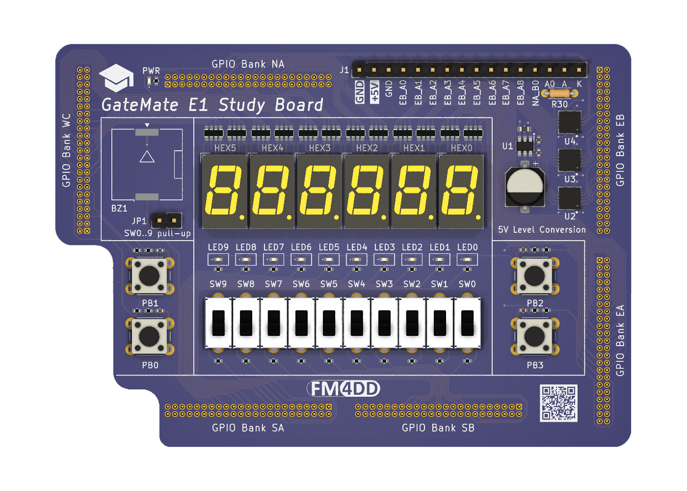
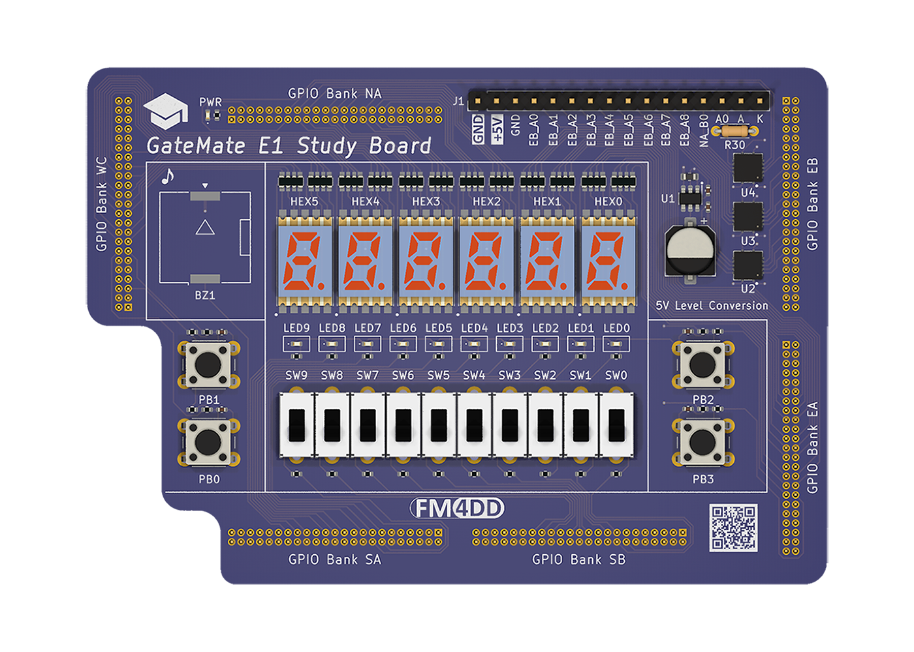
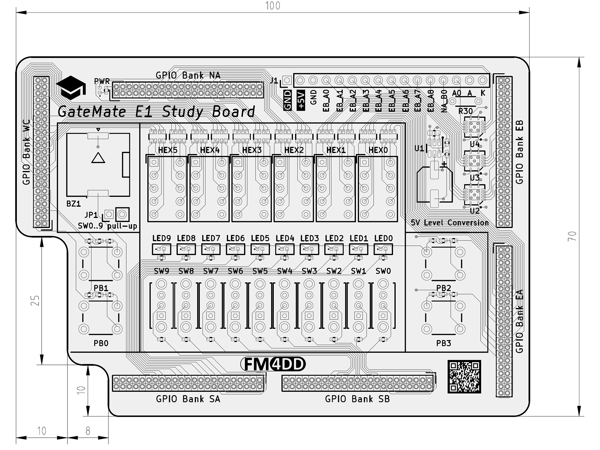
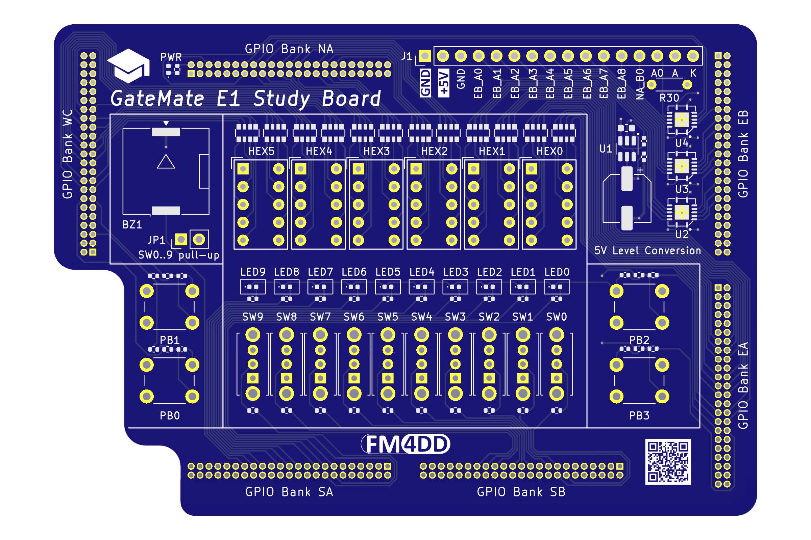
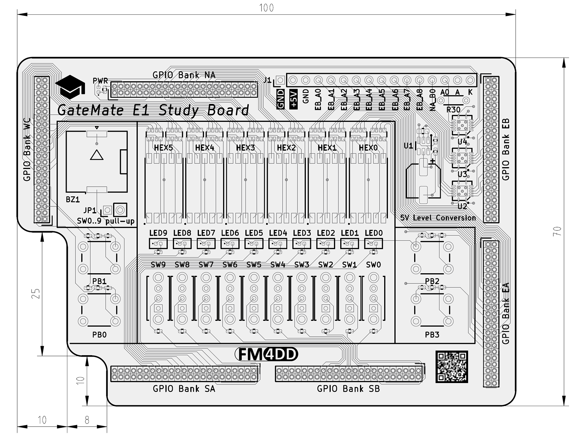
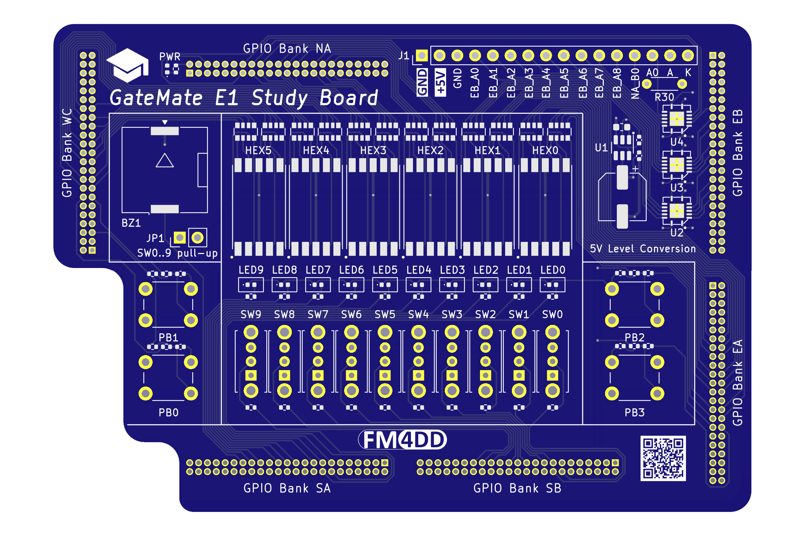
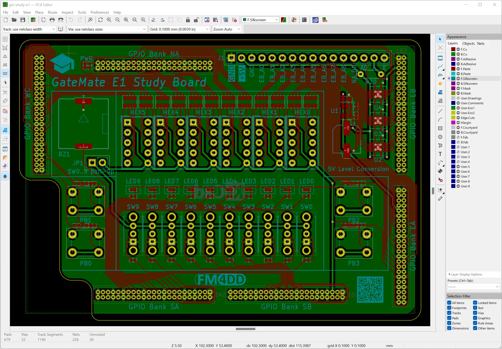

## GM-STUDY-E1

### Description

The gm-study-e1 board is an application module board for the <a href="https://www.colognechip.com/programmable-logic/gatemate-evaluation-board/">GateMate FPGA evaluation board E1</a>, made by <a href="https://www.colognechip.com/">Cologne Chip</a>. It connects to the evaluation board through all six GPIO headers, and its main feature are the input/output components similar to popular FPGA trainer boards used for classroom teaching in electrical engineering and embedded systems education (e.g. Digilent Basys or Altera DE10-lite). These boards were created during first successful design tests of the <a href="https://github.com/fm4dd/gm-proto-e1">gm-proto-e1</a> boards. The "gm-proto-e1" board provides only a few basic I/O, while offering a 2.54mm prototyping area for experimentation with GateMate E1.

### Overview

The gm-study-e1 boards provide:
- 4x push buttons
- 10x slide switches
- 10x LED
- 6x 7-Segment display modules (non-multiplexed)
- 1x 4 Khz buzzer
- J1 2.54mm pin header with 5V signal translation

The J1 pin header and pinout can connect 5V HD44780 character LCD display modules, or interface with breadboards for prototyping. There, the FPGA 2.5V IO signals are translated into 5V TTL levels, which can be used with an Arduino.

### Hardware Versions

Two board variants have been designed: SMD, using 0.28" SMD 7-Segment modules, and THT for using slightly bigger 0.3" through-hole 7-Segment modules. For THT components, great care needs to be taken to cut pins flush during soldering, and prevent them from reaching components of the evaluation board below. The 1.27mm pitch GPIO connectors are offered with different distance spacers (2, 2.5 and 5mm), and the standard spacers achieve only 5mm total clearance.

Both gm-study-e1 application boards have been designed as a 100x70mm double-layer PCB with precision alignment of the six 46-pin 1.27mm pitch GPIO bank connectors (mates all 276 pins with the GateMate FPGA evaluation board E1 V3.1B).

#### Through-hole Design:

| Version | Gerber | Schema |
|---------|--------|--------|
| 1.0     |[20220918-gm-study-e1-tht-gerber.zip](fabfiles-tht/v10/20220918-gm-study-e1-tht-gerber.zip) | [20220918-gm-proto-e1-schematic.pdf](fabfiles-tht/v10/20220918-gm-study-e1-tht-schematic.pdf) |

 
 

#### Surface-Mount Design:

| Version | Gerber | Schema |
|---------|--------|--------|
| 1.0     |[20220916-gm-study-e1-smd-gerber.zip](fabfiles-smd/v10/20220916-gm-study-e1-smd-gerber.zip) | [20220916-gm-study-e1-smd-schematic.pdf](fabfiles-smd/v10/20220916-gm-study-e1-smd-schematic.pdf) |

 
 

### Pin Assignments

Both variants (THT and SMD) have identical pinout, listed in [pin-assignment.md](pin-assignment.md).
They share a single constraints assignment file, located here: [gm-study-e1.ccf](examples/gm-study-e1.ccf)

### Example Code

The following code examples demonstrate the board input/output components for quick verification. The code has been tested with the pre-compiled opensource toolchain released through the GateMate support site at <a href="https://www.colognechip.com/mygatemate/">https://www.colognechip.com/mygatemate/</a>

| Language | Folder                   | Description                                                       |
|----------|--------------------------|-------------------------------------------------------------------|
| Verilog  |[blink](examples/blink)   | blinks five LED's in a alternating pattern                        |
| Verilog  |[count](examples/count)   | binary counter displayed on ten LED and six 7-Segment digits      |
| Verilog  |[button](examples/button) | push button press changes LED frequency and light move direction  |
| Verilog  |[switch](examples/switch) | each slide switch turns its corresponding LED on or off           |

### Board Pictures

The gm-study-e1 application board has been designed with KiCad version 6.0.

